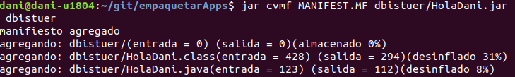
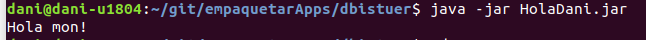
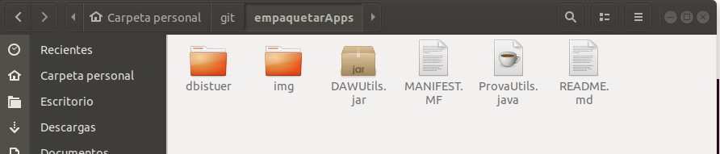
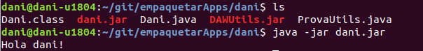

# 1 CREAR APLICACIONS AMB JAR

1. Crea un JAR amb una aplicació que ens mostri “Hola món!”, explica clarament com i
quines instruccions has fet anar per crear-lo.

> Creem un fitxer amb la classe dins almb l'extensio '.java'.

> Seguidament amb la comanda: **javac (Carpeta amb el nom del package)/(nom de la classe).java** i es creara el fitxer '.class'.

>Afegirem el manifest.mf amb la versio de la app, el creador i la ruta del main.

>crearem el '.jar' amb la comanda: **jar cvmf MAINFEST.MF (ruta/nom de l'arxiu.jar) carpeta**

2. Executa el JAR, i mostra el seu resultat.

>Per executar-lo sera amb la seguent comanda: **java -jar (nom d'arxiu.jar)**

# 2 INCLOURE JAR'S A LA MEVA APLICACIÓ

1. Descarrega't el JAR DAWUtils.jar, l'API d'aquest JAR i l'exemple ProvaUtils.java.

2. Crea el teu propi package i actualitza el fitxer ProvaUtils.java de forma que estigui dins d'aquest.

3. Intenta executar ProvaUtils. Cal fer-ho de tres formes diferents:

1. Fes ús de l'opció - classpath
>Al moment de fer la compilació del codi li posa la ruta amb de quina classe volem que s'apliqui i on es troba aquestes 

*java -classpath "/empaquetarApps/dani" Dani*
2. Posa el JAR en el teu CLASSPATH
>Al moment de fer la compilació del codi li posa la ruta amb de quina classe volem que s'apliqui i on es troba aquestes.

3. Inclou el JAR dins el teu MANIFEST.MF
>En crear un arxiu on deixes estipulats simplement sol te que el llegeix a l'hora de capil·lar.

Manifest-Version: 1

Created-By: 1

Main-Class: dani.holadani

Class-Path: DAWUtils.jar

4. Quina de les tres opcions anteriors trobes millor?
>Millor no se quina pot ser pèro mes senzilla jo crec que es posarho al MANIFEST
5. Detalla tot comentant el codi que fa en general el programa i en concret cada línia, el programa ProvaUtils.java .

